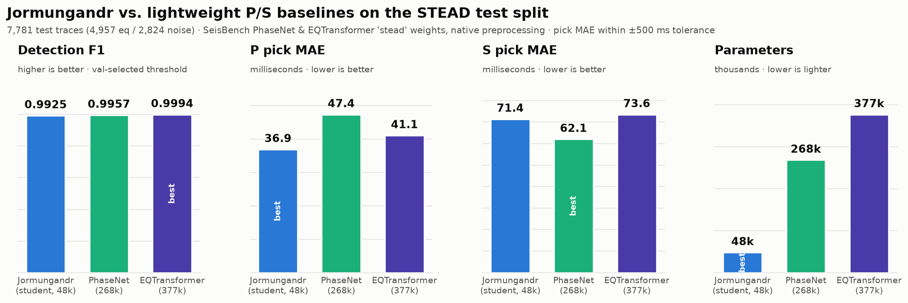
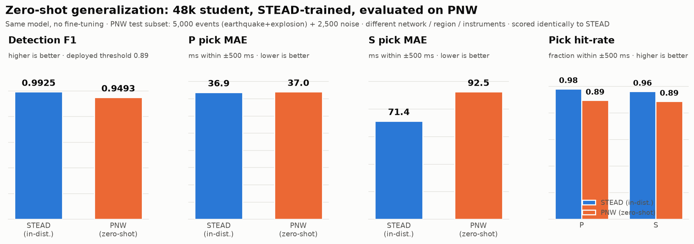

# Jormungandr

Jormungandr is a compact seismic event detector and phase picker built to run
directly on a remote sensor instead of a server. It reads a 60 second,
3 channel, 100 Hz waveform and outputs three per sample probability streams
(event detection, P arrival, S arrival) from a 1D U Net small enough for real
time INT8 inference on a Raspberry Pi. The model is distilled from a large
pretrained **EQTransformer** teacher, trained on
[STEAD](https://github.com/smousavi05/STEAD) via
[SeisBench](https://github.com/seisbench/seisbench), and benchmarked as a live
streaming trigger against the classical **STA/LTA** energy detector. The
repository and distribution are named **Jormungandr**; the stable Python
import package remains `seismic_edge_picker`.

## The problem

Remote seismic and vibration sensors (a borehole station, a Pi with an
accelerometer, anything on a satellite or cellular uplink) are typically
constrained in bandwidth, power, and data cost, so continuously streaming raw
waveform data back to a server is impractical. Most of that bandwidth would be
spent on the long stretches of ordinary ground noise between events. A sensor
in this position has to decide locally whether an event worth reporting is
occurring, and transmit only then.

The standard tool for that decision is **STA/LTA**, a short term average over
long term average energy ratio. It is cheap to compute and has decades of
field use, but it triggers on energy rather than on the shape of a seismic
arrival, so any sharp, non-seismic burst (a passing truck, a door slam, wind
loading a mast) can trigger it, and each false trigger costs a transmission.

This project asks whether a small model, distilled down to run on the sensor
itself, can tell real events from noise well enough to serve as, or gate,
that trigger: reducing false alarms and the bandwidth spent reporting them
without a meaningful loss of recall on real earthquakes.

## Approach

We start from EQTransformer, a 377k parameter attention and BiLSTM model that
is an established, well validated picker but is built for server hardware.
From it we distill a 48,051 parameter 1D U-Net using only `Conv1d`,
`BatchNorm1d`, `ReLU`, and nearest neighbor upsampling, ops that quantize
cleanly, training first on hard labels and then on the teacher's soft
outputs. The distilled model is quantized to INT8, which roughly halves its
size and is what brings it under the Raspberry Pi's latency budget. Because
the base architecture consumes an entire 60 second window at once, a separate
strictly causal variant is trained in which each output sample depends only
on past input, so it can run as an online streaming detector rather than
scoring after the fact. Both models are evaluated primarily on the metric
that matters for on-device gating, not detection F1 on a curated test set
alone, but false triggers per hour of continuous operation and, in an
end-to-end demo, the bytes a session actually transmits, compared directly
against STA/LTA.

## Summary of results

Full numbers, tables, and reproduction commands are in
[Results](#results), [Deployment](#deployment-onnx--int8), and
[Edge demo](#edge-demo-transmission-gating-in-the-field).

- The distilled student (48,051 params) reaches F1 0.9925 under a fair,
  teacher-favorable protocol, against the teacher's (376,935 params) F1
  0.9994: a 7.8x size reduction for a small F1 gap, with the student's pick
  timing tighter than the teacher's on both P (36.9 vs 41.1 ms) and S (71.4
  vs 73.6 ms).
- The causal streaming variant runs as an online detector at F1 0.979 with
  3.1 false triggers per hour, against 17.5 false triggers per hour for
  tuned STA/LTA on the same data (about 6x fewer), with about 27x tighter
  onset timing when it does fire (54 ms vs 1,458 ms MAE).
- In a 6 minute end-to-end replay of real STEAD earthquakes, the model gate
  transmitted 4 packets (all real events, 8,746 bytes total) against
  STA/LTA's 7 packets (1 false, 27,712 bytes); continuous raw transmission
  over the same session would cost 216,000 bytes. That is roughly a 25x
  bandwidth reduction versus raw transmission, and about a third of what
  STA/LTA used.
- On the sensor: 48,051 parameters, 0.10 MB as INT8 ONNX, 2.4 ms per 60
  second window on a Raspberry Pi CPU (one thread), well under real time at
  the default 30 second streaming hop.

## Live demos

**[Interactive streaming demo](https://hsnterp.github.io/Jormungandr/demo.html)**
replays six STEAD test traces as a live left to right stream: the raw
3 channel waveform arrives while the student's detection / P / S probability
streams respond in sync, with ground truth arrivals (dashed), EQTransformer
teacher picks (dotted), and PhaseNet baseline picks (aqua short dash)
overlaid, plus a per trace latency / confidence readout. Cases include a
clean high SNR event, a near threshold low SNR event, pure noise (correct
true negative), and a failure case (an 8.9 s P miss that both baselines catch).
Self contained page in [`docs/demo.html`](docs/demo.html), data in
[`outputs/figures/demo_traces.json`](outputs/figures/demo_traces.json)
(exported by `scripts/export_demo_traces.py`).

> GitHub Pages is served from `/docs` on `main`, so this demo publishes at the
> URL above a minute or two after a commit lands. You can also open
> `docs/demo.html` locally (it embeds an offline copy of the data), or serve
> the folder with `python -m http.server`.

**Edge transmission gating demo.** `scripts/demo_edge.py` runs the causal
INT8 model on a Raspberry Pi (or a synthetic / replayed source) as a live
transmission gate, head to head with STA/LTA, and reports bytes actually
sent. It is not hosted online since it drives real or replayed sensor input;
run it locally, or generate the self contained recorded browser view:

```bash
python3 scripts/export_gating_traces.py   # re-scores the real STEAD replay bundle
open outputs/demo/gating_demo.html        # no server needed, works over file://
```

Full walkthrough, wiring diagram, and a three act recording script:
[`scripts/DEMO.md`](scripts/DEMO.md). Details and numbers below in
[Edge demo](#edge-demo-transmission-gating-in-the-field).

## Reading this README

A few terms, for a reader who has not worked with seismic data before:

- **P wave**: the primary wave, the fastest seismic wave and the first
  arrival at a station. A "P pick" is the estimated P arrival sample.
- **S wave**: the secondary (shear) wave, slower, arrives after the P, and is
  usually larger. An "S pick" is the estimated S arrival sample.
- **SNR**: signal to noise ratio in decibels. Higher means a cleaner, easier
  event; lower means a faint event buried in noise.
- **F1**: the harmonic mean of precision (fraction of triggers that are real
  events) and recall (fraction of real events caught). One number from 0 to
  1 that balances false alarms against misses.
- **STA/LTA**: short term average over long term average, a decades old
  energy ratio trigger. It is the baseline this project compares against for
  the on edge gating question.

How to read the pick numbers in the tables below: **MAE** (mean absolute
error, in ms) is computed only over picks that land within the ±500 ms match
tolerance (the "hits"), so a gross mis-pick or a missed onset shows up in the
**hit rate** (fraction of true arrivals picked within ±500 ms), not in the
MAE. Read each MAE together with its hit rate: MAE says how tight the good
picks are, hit rate says how often a good pick happens at all.

## Task formulation

| | |
|---|---|
| **Input** | `(3, 6000)`: 3 components, 60 s @ 100 Hz |
| **Output** | `(3, 6000)` sigmoid streams: detection / P / S |
| detection | 1.0 across the event window (P to coda) |
| P / S | Gaussian bump (σ ≈ 0.25 s) centered on the arrival |
| noise | all-zero target |

## Architecture

```
input  (3, 6000)
  │  stem: conv k7 s2  + BN + ReLU
  ▼
 s0 (16, 3000) ───────────────────────────────────skip──────────────┐
  │  enc1: [dw k7 s2 → pw → BN → ReLU]                               │
  ▼                                                                  │
 e1 (16, 1500) ──────────────────────────────skip────────┐          │
  │  enc2                                                 │          │
  ▼                                                       │          │
 e2 (32, 750) ─────────────────────────skip───┐          │          │
  │  enc3                                      │          │          │
  ▼                                            │          │          │
 e3 (64, 375) ──────────────────skip┐         │          │          │
  │  enc4                           │         │          │          │
  ▼                                 │         │          │          │
 e4 (96, 188)                       │         │          │          │
  │  bottleneck: 2× dw-sep, dil 2,4 │         │          │          │
  ▼                                 │         │          │          │
 b  (96, 188)                       │         │          │          │
  │  dec1: NN-up→375, cat e3, ds ◄──┘         │          │          │
  ▼                                           │          │          │
    (64, 375)                                 │          │          │
  │  dec2: NN-up→750, cat e2, ds ◄────────────┘          │          │
  ▼                                                      │          │
    (32, 750)                                            │          │
  │  dec3: NN-up→1500, cat e1, ds ◄─────────────────────-┘          │
  ▼                                                                 │
    (16, 1500)                                                      │
  │  dec4: NN-up→3000, cat s0, ds ◄────────────────────────────────-┘
  ▼
    (16, 3000)
  │  NN-up→6000, head 1x1 conv, sigmoid
  ▼
output (3, 6000)
```

- **Only INT8-friendly ops**: `Conv1d`, `BatchNorm1d`, `ReLU`, nearest neighbor
  `interpolate`. No LSTM, no attention, no transposed conv.
- Depthwise-separable blocks throughout keep the parameter count tiny.

**Measured at init** (`scripts/inspect_model.py`):

| metric | value |
|---|---|
| parameters | **48,051** (budget < 300k ✅) |
| MFLOPs / 60 s window | **38.1** |
| output range | `[0,1]` sigmoid ✅ |

### Design rationale and cost ablations

Every architectural choice traces back to the deployment constraints: under
300k parameters, INT8-only ops, real time single thread CPU. The tables below
make the trade-offs concrete: each variant is instantiated and measured with
the same parameter/FLOP counters as `inspect_model.py`, plus the analytic
receptive field (RF) of one bottleneck sample along the encoder path.
Reproduce every number with:

```bash
python scripts/ablation_costs.py   # no data or checkpoint needed
```

> **Scope note.** These are cost side ablations: parameters, compute, and
> receptive field are properties of the architecture and are measured
> exactly. Accuracy side ablations for the architecture variants (retraining
> each regular conv / depth / width / kernel variant through Stage 1 + Stage
> 2) were not run; each row would cost a multi hour GPU run. Accuracy
> ablations for the training recipe and quantization, which reuse checkpoints
> that already exist, were run: see
> [Ablations, distillation and quantization](#ablations-distillation-and-quantization-accuracy)
> and the teacher comparison in [Results](#results).

**Why depthwise-separable blocks?** A regular `Conv1d` costs `k·C_in·C_out`
weights per layer; a depthwise-separable block factors that into `k·C_in`
(depthwise) plus `C_in·C_out` (pointwise), roughly a 5 to 7x reduction at
these widths for `k=7`. Swapping every DS block for a regular conv of
identical shape is the single most expensive design change available:

| block type | params | MFLOPs / window | bottleneck RF |
|---|---:|---:|---:|
| **depthwise-separable (shipped)** | **48,051** | **38.1** | 13.4 s |
| regular `Conv1d`, same widths | 295,363 (6.1×) | 212.4 (5.6×) | 13.4 s |

One change nearly exhausts the entire 300k budget and multiplies compute by
5.6x while adding zero receptive field. DS convs are also a known good INT8
path (the MobileNet lineage); the depthwise stage's quantization sensitivity
is handled by per channel weight quantization in deployment, and the measured
INT8 degradation stayed small (F1 -0.0024).

**Why four encoder levels?** Depth buys receptive field but costs parameters
and temporal resolution at the bottleneck. The detection stream has to
integrate context spanning P through coda (many seconds), while the P/S
streams need sample level timing, recovered through the skip connections:

| encoder levels | params | MFLOPs / window | bottleneck RF | bottleneck (stride, len) |
|---|---:|---:|---:|---|
| 3 (16,32,64) | 18,963 | 26.5 | 6.7 s | ×16, 375 |
| **4 (16,32,64,96) (shipped)** | **48,051** | **38.1** | **13.4 s** | ×32, 188 |
| 5 (16,32,64,96,128) | 99,443 | 48.3 | 26.8 s | ×64, 94 |

Three levels cap the bottleneck RF at 6.7 s, shorter than typical P-to-coda
durations in STEAD's local/regional traces, so the detection stream would
have to call "event vs noise" without ever seeing a whole event envelope.
Five levels double the parameter bill (99k) and coarsen the deepest features
to one sample per 0.64 s for RF the dilated bottleneck already provides more
cheaply (next paragraph). Four levels is the knee of the curve.

**Why a dilated bottleneck (2, 4)?** Dilation is the cheapest receptive field
in the network: it changes neither the parameter count nor the FLOPs, only
the spacing of the depthwise taps:

| bottleneck | params | MFLOPs / window | bottleneck RF |
|---|---:|---:|---:|
| no dilation (1,1) | 48,051 | 38.1 | 5.7 s |
| **dilations (2,4) (shipped)** | 48,051 | 38.1 | **13.4 s** |

The two dilated blocks take the 4-level encoder from 5.7 s to 13.4 s of
context for free. This is also the real answer to "why not 5 levels": the
fifth level would spend about 51k parameters buying context that dilation
provides at zero cost.

**Why channels 16 to 32 to 64 to 96?** Two forces shape the ladder. FLOPs
scale with channels times sequence length, so the early, 1500 to 3000 sample
stages must stay narrow; capacity belongs deep, where sequences are short.
The top width stops at 96 (not a "clean" 128) to keep the two bottleneck
blocks and the first decoder stage, which all operate at the widest channel
count, inside the budget:

| width ladder | params | MFLOPs / window |
|---|---:|---:|
| half (8,16,32,48) | 13,531 | 11.6 |
| **shipped (16,32,64,96)** | **48,051** | **38.1** |
| uniform 64 (64,64,64,64) | 66,563 | 141.6 |
| double (32,64,128,192) | 180,067 | 136.2 |

The uniform-64 row is the instructive one: only 1.4x the parameters of the
shipped ladder but 3.7x the compute, because 64 channels at 3000-sample
resolution dominate the MACs. That is why the ladder tapers instead of
staying flat: parameters live wherever you put them, but FLOPs live at high
temporal resolution. Doubling the ladder (180k params, 3.6x compute) stays
under the budget but buys capacity the results suggest is not the
bottleneck: the shipped 48k student already beats the 377k teacher on both
pick MAEs (see [Fairness corrections](#fairness-corrections)). Halving it
(13.5k) was judged too tight for three dense per sample output streams,
though it was not trained to confirm.

**Why kernel size 7?** Under the DS factorization the kernel only appears in
the depthwise term (`k·C_in`), so kernel size is nearly free in parameters
but scales the receptive field linearly:

| kernel | params | MFLOPs / window | bottleneck RF |
|---|---:|---:|---:|
| k=3 | 45,235 | 33.8 | 4.5 s |
| k=5 | 46,643 | 36.0 | 8.9 s |
| **k=7 (shipped)** | **48,051** | **38.1** | **13.4 s** |
| k=11 | 50,867 | 42.4 | 22.3 s |

k=3 (the image classification default) leaves only 4.5 s of context, the RF
problem three encoder levels have, all over again. k=7 reaches the 13.4 s
target; k=11 adds about 11% compute for headroom nothing in the task
formulation asks for.

## Results

**Headline model: the Stage 2 EQTransformer-distilled student.** The
training checkpoint is reproduced at `checkpoints/stage2_distill/best.pt`;
the included public deployment artifact is
`outputs/onnx/stage2_distill_int8.onnx`. Everything in this section is
evaluated on the identical held out test split (7,781 traces: 4,957
earthquake / 2,824 noise) with identical detection/pick tolerances (peak
height 0.3, match tolerance ±500 ms), so every row is directly comparable.
Term definitions and how to read pick MAE/hit-rate are in
[Reading this README](#reading-this-readme).

### Headline comparison (test split)

MAE is over hits (picks within ±500 ms) only; the **hit** column next to each
MAE is the fraction of true arrivals picked within ±500 ms.

| model / operating point | params | precision | recall | **F1** | FP (noise) | FN (eq) | P MAE±std | P hit | S MAE±std | S hit |
|---|---|---|---|---|---|---|---|---|---|---|
| **Stage 2 distilled, max-F1 (thr 0.80)** | **48,051** | 0.9910 | 0.9978 | **0.9944** | 45 | 11 | **36.9±56.3 ms** | 0.981 | **71.4±109.4 ms** | 0.961 |
| **Stage 2 distilled, low-false-alarm (thr 0.90 + 500 ms)** | 48,051 | 0.9977 | 0.9831 | 0.9903 | **11** | 84 | 36.9±56.3 ms | 0.981 | 71.4±109.4 ms | 0.961 |
| Stage 2 distilled, default (thr 0.50) | 48,051 | 0.9649 | 0.9994 | 0.9819 | 180 | 3 | 36.9±56.3 ms | 0.981 | 71.4±109.4 ms | 0.961 |
| Stage 1 supervised, max-F1 (thr 0.90 + 500 ms) | 48,051 | 0.9894 | 0.9964 | 0.9929 | 53 | 18 | 46.0±77.4 ms | —‡ | 72.4±112.3 ms | —‡ |
| Stage 1 supervised, default (thr 0.50) | 48,051 | 0.9227 | 0.9998 | 0.9597 | 415 | 1 | 46.0±77.4 ms | —‡ | 72.4±112.3 ms | —‡ |
| EQTransformer teacher † (thr 0.50) | 376,935 | 0.993 | 0.979 | 0.9860 | 35 | 103 | 62.8±88.4 ms | 0.959 | 78.9±117.5 ms | 0.948 |
| EQTransformer teacher † (best-F1 @ 0.15) | 376,935 | 0.984 | 0.990 | 0.9867 | 81 | 51 | 62.8±88.4 ms | 0.959 | 78.9±117.5 ms | 0.948 |

‡ Stage-1 hit-rates are not re-tabulated here: the Stage-1 checkpoint is not
shipped and its `outputs/stage1_eval/` metrics are not committed; rerun
`scripts/evaluate.py` (which now reports `hit_rate_within_tol`) on a Stage-1
checkpoint to fill these. Pick-timing MAEs shown are from the committed
Stage-1 history. The pick **hit** columns are threshold-independent (picks
come from the fixed peak-height 0.3 rule), so both teacher rows share one P/S
hit-rate.

† These two EQTransformer rows are the handicapped baseline: the teacher fed
the student's preprocessing at a fixed/test-picked threshold. Its fair
numbers (native preprocessing, validation-selected threshold: F1 0.9994,
P/S-MAE 41.1/73.6 ms) are in [Fairness corrections](#fairness-corrections)
below.

**What distillation bought (same 48,051-param model, only better weights):**
at the config-default threshold 0.50, distillation more than halved noise
false alarms (415 to 180), lifting F1 from 0.9597 to 0.9819, and tightened P
picks (MAE 46.0 to 36.9 ms, S 72.4 to 71.4 ms), the precision gain the
teacher was expected to transfer. After the free threshold and min-duration
postprocessing, the distilled student reaches F1 0.9944 (45 noise FP, 11
missed events), beating both the Stage 1 tuned student (0.9929) and the
7.8x-larger EQTransformer teacher's handicapped best (0.9867); see
[Fairness corrections](#fairness-corrections) below, where the teacher
reaches F1 0.9994 under its native input. Its low-false-alarm operating
point drives noise false alarms down to 11 / 2,824 (0.4%) while still
recovering 98.3% of events. Both models' val weighted BCE is about 0.0179:
the main gains are in the shape of the detection/pick streams, not the
aggregate loss. Full metrics, SNR-bucket breakdown, and residual histograms:
`outputs/stage2_eval/` (`test_metrics.json`, `snr_breakdown.csv`,
`pick_residuals.png`, `summary.txt`, `threshold_recommendations.json`);
Stage 1's equivalents remain in `outputs/stage1_eval/`.

### False alarms in continuous operation

The deployment target is an autonomous, on-device trigger: the model decides
locally that an event happened and acts (transmits a detection, fires an
actuation) with no server, no coincidence check across stations, and no human
veto. In that setting the number that actually governs the system is not
per-window false positives on a curated noise set, it is false triggers over
time, because every false trigger acts. This subsection converts the
per-window noise FP rate into that operating figure. Reproduce with
`python scripts/false_alarm_rate.py` (artifact:
`outputs/false_alarm/false_alarm_rate.json`).

At the deployed INT8 model's low-false-alarm operating point (threshold 0.90
+ 500 ms min-duration) the per-window false-positive rate on curated STEAD
noise is 11 / 2,824, or 0.39% per 60 s window. With the default 30 s
streaming hop the model evaluates `3600 / 30 = 120` windows per hour, so:

| operating point | per-window noise FP | false triggers/hour | false triggers/day |
|---|---|---|---|
| **low-false-alarm (thr 0.90 + 500 ms), deployed** | 11 / 2,824 (0.39%) | **≈ 0.47** | **≈ 11** |
| INT8 max-F1 (thr 0.80), measured | 29 / 2,824 (1.03%) | ≈ 1.23 | ≈ 30 |
| FP32 max-F1 (thr 0.80), measured | 45 / 2,824 (1.59%) | ≈ 1.91 | ≈ 46 |

So at its deployed low-false-alarm point the trigger fires on quiet ground
roughly once every ~2 hours (~11 times/day) under this upper-bound estimate;
looser operating points cost proportionally more (thr 0.80 ≈ 30/day). This
time-based rate, not the per-window FP count, is the metric an unsupervised
actuator lives on: a 0.4% per-window FP looks negligible, but at 120
windows/hour it is an actuation every couple of hours, which is what a
downstream power/duty-cycle budget must absorb.

**Assumptions (deliberately explicit).** The estimate is
`false_triggers/hour ≈ (FP / n_noise) × (3600 / hop_s)` and assumes: (1) each
streaming window behaves like one independent 60 s curated-noise trial; (2)
windows advance by the 30 s hop (60 s windows overlap 50%, and the streaming
path coalesces detections within `event_merge_gap_s`, which can only merge
adjacent false triggers, so this is an upper estimate); (3) field noise
resembles STEAD's curated noise. The low-false-alarm FP count is the
reference Stage-2 student's measurement; the shipped INT8 model was not
separately revalidated at thr 0.90 + 500 ms (consistent with the streaming
caveat below), so the INT8-measured thr 0.80 row brackets the rate from
above. As an end-to-end path check, `scripts/false_alarm_rate.py --smoke`
streams one hour of synthetic noise through the deployed INT8 ONNX model and
produces 0 false triggers; a direct measurement on real continuous noise
(`--noise-npy`) drops in when a continuous STEAD-noise stream is available.

### The causal streaming detector, versus STA/LTA

Everything above scores the shipped model on curated, batched windows. The
question that actually matters for on-edge gating is different: run as a
true live stream, sample by sample, with only past context available, how
does the model compare to STA/LTA, the incumbent it needs to beat?

**Why causal at all.** `SeismicUNet` as trained above is non-causal: it
consumes the whole 60 s window at once, so an output sample may depend on
future input, which a live sensor does not have yet. Before committing to a
causal variant, `scripts/lookahead_ablation.py` measured how much future
context ("right context") the picks actually need, by forbidding the model
from seeing input more than Δ seconds past each arrival and re-scoring with
the same metrics as `evaluate.py`. Two numbers came out of that
sweep (smallest Δ recovering at least 99% of the unbounded-context value):
**L_P ≈ 7 s** for the P-trigger, and **L_pick ≈ 7 s** for the full picker
(S timing). They coincide: separating the trigger did not buy a shorter
lookahead, because the shipped model's P stream itself leans on about 7 s of
post-onset context (partly the S phase becoming visible, median S-P is about
4.5 s, partly early coda). Pick timing recovers much faster than recall
though (P MAE reaches about 32 ms by Δ ≈ 0.5 s), so once a pick fires its
timing is already good; the lookahead cost is in crossing the detection
threshold, not in placing the pick.


| Δ (s) | P trig F1 | P recall | P MAE (ms) | S trig F1 | S recall | S MAE (ms) |
|------:|----------:|---------:|-----------:|----------:|---------:|-----------:|
| 0     | 0.071 | 0.037 | 65.7 | 0.108 | 0.058 | — |
| 0.5   | 0.248 | 0.141 | 35.1 | 0.197 | 0.110 | 107.0 |
| 1     | 0.696 | 0.534 | 42.2 | 0.458 | 0.298 | 64.8 |
| 2     | 0.752 | 0.602 | 42.7 | 0.629 | 0.461 | 49.2 |
| 5     | 0.780 | 0.639 | 32.5 | 0.818 | 0.696 | 60.9 |
| **7** | **0.997** | **0.995** | **31.9** | **0.981** | **0.969** | **69.6** |
| ∞     | 1.000 | 1.000 | 31.6 | 0.987 | 0.979 | 69.5 |

Full curves, CSV (per-phase columns), and the key-number note:
[`outputs/lookahead/`](outputs/lookahead/). Regenerate with
`python scripts/lookahead_ablation.py --n 300` (add `--phase P` for the
trigger only, or `--smoke` for a synthetic run needing no dataset).

**The causal model itself.** `SeismicUNet(causal=True, lookahead=0)` uses
left-only conv padding and floor-aligned upsampling so `output[t]` depends
only on input up to `t` (verified by `tests/test_causal.py`), with forward
only causal preprocessing (single-pass bandpass plus running normalization).
It keeps the shipped model's tensor shapes, so `checkpoints/stage2_distill/best.pt`
warm-starts training (78/78 tensors, none skipped); the primary run is 20
epochs on STEAD reusing the existing distillation loss and pipeline.

```bash
python scripts/train_distill.py --causal --data                       # primary (strictly causal)
python scripts/causal_latency_curve.py --data --split test --n 2000   # main curve + table
python scripts/pnw_zeroshot.py --causal \
    --checkpoint checkpoints/stage3_causal/best.pt                    # OOD (never train on PNW)
```

A running-normalization bug had to be fixed first: dividing by the central
std collapsed to near zero over the first few samples, spiking some inputs
to about 1e8 on roughly 1.7% of STEAD-train traces and poisoning the first
BatchNorm's running variance, which made the model collapse to a constant
output in eval mode while looking healthy in train mode. Using the running
RMS instead (equal to std for the zero-mean, post-demean stream in steady
state, but unable to collapse) fixed it; see
`src/seismic_edge_picker/preprocessing.py` and `outputs/causal/RUN_LOG.md`.

**Headline result (STEAD test, 2,000 traces): P-recall achievable within each
onset-to-alarm latency budget.** Shipped non-causal U-Net via the
right-context masking proxy; causal U-Net and tuned STA/LTA via true
streaming latency (`outputs/causal/recall_latency.png`, `latency_curve.csv`):

| latency budget | shipped (proxy) | causal U-Net (streaming) | STA/LTA (streaming) |
|---|---|---|---|
| 0.5 s | 0.17 | 0.00 | **0.58** |
| 1 s | 0.51 | 0.15 | **0.77** |
| 2 s | 0.60 | 0.31 | **0.82** |
| 5 s | 0.66 | **0.79** | 0.86 |
| 7 s | **0.97** | 0.96 | 0.88 |
| inf | 0.98 | 0.97 | 0.95 |

Detection / timing / false-alarm comparison (STEAD test; STA/LTA is a
detector, so phase-classification cells are N/A):

| system | precision | recall | F1 | MAE\|hit | false-trig/hr | median lat | p90 lat |
|---|---|---|---|---|---|---|---|
| **Causal U-Net (pure)** | **0.986** | 0.972 | **0.979** | 54 ms | **3.1** | 3.99 s | 5.99 s |
| Causal U-Net (latency-aware) | 0.964 | 0.988 | 0.976 | 30 ms | 9.0 | 3.99 s | 5.99 s |
| STA/LTA (tuned) | 0.923 | 0.948 | 0.936 | 1458 ms | 17.5 | **0.25 s** | 4.33 s |

**Negative result on latency.** Forcing causality
did not recover low-latency P-recall: the causal model's median
onset-to-alarm is about 4 s, and its recall at 0.5 s is near zero. Two
independent checks confirm this is intrinsic, not a training artifact: pure
causality (the model cannot use post-onset context at train time) still
fires at about 4 s, and an explicit latency-aware loss that rewards early P
firing did not move the latency at all (median still 3.99 s); it only traded
precision for recall (0.986 to 0.964, false triggers 3.1 to 9.0/hr).
Causality bounds the receptive-field direction, not the decision latency: at
`onset + 4s` the model can still integrate 4 s of post-onset energy and
choose to withhold its alarm until then. STA/LTA's low-latency edge (median
0.25 s) is real and is exactly the tradeoff it makes for being noisier.

**Summary.** The causal model is a streaming-capable detector matching the
non-causal ceiling on F1 (0.98), and versus tuned STA/LTA it has about **6x
fewer false triggers** (3.1 vs 17.5/hour) and about **27x tighter onset
timing** (54 vs 1,458 ms MAE). It is preferred over the latency-aware variant
(same latency, higher precision, fewer false alarms). This is the model used
for transmission gating in the rest of this document: not a latency
improvement over STA/LTA (STA/LTA still reacts faster), but a large
reduction in false alarms and a more precise onset time, on a strictly
causal model that runs on the sensor. See the [Edge demo](#edge-demo-transmission-gating-in-the-field)
section below for what that looks like end to end, in bytes.

**Export.** `outputs/onnx/stage3_causal.onnx` (parity max-abs-err 1.2e-6) and
INT8 `stage3_causal_int8.onnx` (0.224 to 0.119 MB, -47%); FP32 F1 0.992 to
INT8 0.981 (a 0.011 drop), the same modest INT8 sensitivity as the shipped
model.

**Generalization to PNW (out-of-distribution, zero-shot, never trained on
PNW).** Batch eval via `scripts/pnw_zeroshot.py` on 3,000 PNW traces (2,000
events, 1,000 noise); P placed at the window offset. PNW has no
streaming-latency loader, so this reports detection/pick quality, not
latency. STEAD F1 is batch detection at the deployed threshold for both
models:

| model | STEAD F1 | PNW F1 (@0.89) | ΔF1 | PNW P-MAE\|hit | PNW S-pick rate |
|---|---|---|---|---|---|
| Shipped non-causal | 0.992 | **0.951** | -0.041 | **37.3 ms** | **0.92** |
| Causal (pure) | 0.992 | 0.912 | **-0.080** | 89.7 ms | 0.61 |

Both generalize, but the causal model is clearly more brittle
out-of-distribution: about double the detection-F1 drop, P-onset MAE that
more than doubles (37 to 90 ms), and an S-pick rate that collapses from 0.92
to 0.61. With only one-sided context the causal model has less signal to
fall back on under a network, region, or instrument shift. In short, the
STEAD numbers do not transfer cleanly to PNW for the causal variant. See
`outputs/pnw_zeroshot/` (shipped) and `outputs/pnw_zeroshot_causal/`
(causal).

### Fairness corrections

Two protocol fixes make the student-vs-teacher comparison fair. Both are
applied in `scripts/fair_comparison.py`; the corrected numbers live in
`outputs/fair_eval/comparison.json` and drive the regenerated
`outputs/figures/snr_bucketed_performance.png`.

1. **Threshold selected on validation, not test.** The tables above and the
   original SNR chart scored detection at a fixed, a-priori threshold (0.50),
   and the "max-F1" rows picked the threshold on the test split itself. The
   corrected protocol sweeps the detection threshold on the validation split
   only, fixes each model at its val-max-F1 point (student 0.89, teacher
   0.89), and evaluates the test split once at that fixed threshold.
2. **Each model under its own preprocessing.** The original teacher was fed
   the student's pipeline (demean, bandpass 1 to 45 Hz, global-std norm).
   EQTransformer's SeisBench `stead` weights document their own conditioning
   (demean, per-trace peak normalization, 6-sample cosine taper, no
   bandpass); the teacher is now fed that native input via the model's own
   `annotate_batch_pre`. The student's evaluation is unchanged.

Effect on the overall test-split numbers, precision and false positives shown
alongside F1 because for an autonomous trigger they matter more than F1 (see
[False alarms in continuous operation](#false-alarms-in-continuous-operation)).
Precision is the fraction of triggers that are real events; FP (noise) is out
of 2,824 noise traces; MAE is over hits (picks within ±500 ms):

| protocol | student precision | student FP | student F1 | teacher precision | teacher FP | teacher F1 |
|---|---|---|---|---|---|---|
| published (fixed thr 0.50; teacher on student pipeline) | 0.9649 | 180 | 0.9819 | 0.9928 | 35 | 0.9860 |
| + fix 1 (val-selected thr; teacher still on student pipeline) | **0.9955** | **22** | **0.9925** | 0.9926 | 36 | 0.9863 |
| + fix 1 & 2 (val-selected thr; teacher native preprocessing) | 0.9955 | 22 | 0.9925 | **0.9994** | **3** | **0.9994** |

**Full side-by-side under the final fair protocol** (val-selected threshold,
teacher native preprocessing). Precision, recall, false positives and false
negatives for both models, not just F1 (student thr 0.89, teacher thr 0.89):

| model | params | precision | recall | F1 | FP (noise /2,824) | FN (eq /4,957) | P-MAE (hit) | S-MAE (hit) |
|---|---|---|---|---|---|---|---|---|
| **SeismicUNet student** | **48,051** | 0.9955 | 0.9895 | 0.9925 | **22** | 52 | **36.9 ms** (0.981) | **71.4 ms** (0.961) |
| EQTransformer teacher | 376,935 | **0.9994** | **0.9994** | **0.9994** | **3** | **3** | 41.1 ms (0.987) | 73.6 ms (0.975) |

The fair-protocol student here is the FP32 PyTorch checkpoint (identical
picks to the shipped model's FP32 export); the deployed INT8 model's own
precision and FP are in the INT8 static-quantization evaluation table under
[Deployment](#deployment-onnx--int8) (thr 0.80: precision 0.9941, FP
29/2,824).

Fix 1 mainly helps the student: its confident detection wants a high
threshold to shed noise false alarms, precision 0.9649 to 0.9955 and FP 180
to 22, F1 0.9819 to 0.9925. Fix 2 mainly helps the teacher: native input
lifts it from F1 0.9863 to 0.9994 (FP 36 to 3), P-MAE 62.8 to 41.1 ms, and
S-MAE 78.9 to 73.6 ms.

**Revised takeaway.** Under this fair, and teacher-favorable, protocol
the EQTransformer teacher slightly leads on detection (higher F1, 0.9994 vs
0.9925, and fewer noise false alarms, 3 vs 22 out of 2,824) and closes most
of the pick-timing gap, yet the 48,051-param student stays ahead on both pick
MAEs (P 36.9 vs 41.1 ms, S 71.4 vs 73.6 ms) at 7.8x fewer parameters and with
only INT8-friendly ops. The teacher's raw precision edge is the counterpoint
to the student's size and op advantage. In the regenerated SNR
chart the teacher leads F1 in every earthquake bucket; because those buckets
are earthquake-only, per-bucket F1 tracks recall, and the student's
noise-false-alarm advantage shows up only in the overall figure here.

### PhaseNet baseline

PhaseNet is the other standard lightweight P/S picker, a roughly 270k-param
Conv1d U-Net, closer to the student in size and ops than the EQTransformer
teacher. We evaluate SeisBench's pretrained `stead` PhaseNet on the identical
test split under the same corrected protocol (native preprocessing;
detection threshold selected on val and applied once to test). PhaseNet has
no detection head, so its event-present stream is derived as `1 - Noise`
(equal to P + S). Reproduce with `python scripts/phasenet_baseline.py`; the
figure is regenerated by `python outputs/figures/make_baseline_comparison.py`.



Precision and false positives on noise are shown alongside F1 (the metrics
that matter for an unsupervised trigger), and each pick MAE carries its
hit-rate:

| model | params | precision | FP (noise /2,824) | detection F1 | P-MAE (hit) | S-MAE (hit) |
|---|---|---|---|---|---|---|
| **SeismicUNet student** | **48,051** | 0.9955 | **22** | 0.9925 | **36.9 ms** (0.981) | 71.4 ms (0.961) |
| PhaseNet baseline | 268,443 | —§ | —§ | 0.9957 | 47.4 ms (0.916) | **62.1 ms** (—§) |
| EQTransformer teacher | 376,935 | **0.9994** | **3** | **0.9994** | 41.1 ms (0.987) | 73.6 ms (0.975) |

§ PhaseNet's precision, FP-on-noise and S hit-rate are computed by
`scripts/phasenet_baseline.py` (which now emits them), but its raw metrics
(`outputs/phasenet_baseline/pn_metrics.json`) are gitignored and require
SeisBench plus a cached STEAD test split to regenerate; neither is present in
this evaluation environment, so those cells are left blank rather than
guessed. The committed figure (`baseline_comparison.png`) and the
F1/P-MAE/S-MAE/P-hit values above are from the original run.

The 48k-param student is competitive with PhaseNet at about 5.6x fewer
parameters: it leads on P-pick timing (36.9 vs 47.4 ms) and P hit-rate (0.981
vs 0.916), while PhaseNet is the best of the three on S-pick timing (62.1 ms)
and edges the student on overall detection F1. Neither lightweight model
matches the teacher's detection F1, but both are within a few ms on pick
precision; the tiny student trades a little S-onset precision for a third of
PhaseNet's footprint.

### Zero-shot generalization to PNW

To probe out-of-distribution behavior, the STEAD-trained student is run with
no fine-tuning on the [PNW](https://github.com/niyiyu/PNW-ML) benchmark
(Pacific Northwest Seismic Network), a different region, network, and
instrument mix than STEAD. We stream a fixed-seed test subset of 5,000 events
(earthquake and explosion) plus 2,500 noise directly from the SeisBench
remote HDF5 (targeted range reads, so no 67 GB download), reorder PNW's ENZ
components to the model's ZNE, crop each 150 s trace to a 60 s window
placing P at STEAD's typical position, and score with the identical
preprocessing, detection rule, and ±500 ms tolerance. Reproduce with
`python scripts/pnw_zeroshot.py` (figure:
`outputs/figures/make_pnw_zeroshot_figure.py`).



| metric | STEAD (in-distribution) | PNW (zero-shot) |
|---|---|---|
| Detection F1 (deployed thr 0.89) | 0.9925 | 0.9493 |
| P-pick MAE (within ±500 ms) | 36.9 ms | **37.0 ms** |
| S-pick MAE (within ±500 ms) | 71.4 ms | 92.5 ms |
| P hit-rate | 0.981 | 0.894 |
| S hit-rate | 0.961 | 0.886 |

P-onset timing transfers almost perfectly (37.0 ms zero-shot vs 36.9 ms
in-distribution) on a network the model has never seen. Detection F1 falls
about 4 points and pick hit-rates about 9 points (the model turns slightly
conservative and misses more low-SNR onsets), and S-pick scatter widens, but
there is no collapse: a 48k-param model trained only on STEAD remains a
usable detector and a precise P-picker on PNW without a single gradient step
of adaptation. Full metrics, per-SNR breakdown, and residual histograms in
[`outputs/pnw_zeroshot/`](outputs/pnw_zeroshot/).

### Ablations, distillation and quantization (accuracy)

These are accuracy-side ablations: unlike the architecture cost tables
(which are deterministic and need no training), each row below is a
separately trained or exported checkpoint evaluated on the STEAD test split,
so the numbers are real measured accuracy, not estimates.

**Distillation, does the EQTransformer teacher actually help?** The same
student architecture trained from scratch on the hard labels (Stage 1) vs.
distilled from the teacher's soft targets (Stage 2), both at the fixed 0.5
threshold on the identical test split:

| student training | Detection F1 | P-MAE (hit) | S-MAE (hit) |
|---|---:|---:|---:|
| Stage 1, plain (hard labels only) | 0.9597 | 46.0 ms (—‡) | 72.4 ms (—‡) |
| **Stage 2, distilled from EQTransformer** | **0.9819** | **36.9 ms** (0.981) | 71.4 ms (0.961) |

(‡ Stage-1 hit-rates not re-tabulated, see the note under the first results table;
`evaluate.py` now reports `hit_rate_within_tol`. MAE is over hits within
±500 ms only.)

Distillation is worth it: about +2.2 detection-F1 points and about 9 ms of
P-pick timing at identical inference cost (the two checkpoints are the same
48k architecture). S-timing is unchanged. This is the empirical justification
for the two-stage recipe: the teacher's soft targets carry onset-shape
information the hard Gaussian labels don't. Reproduce: `scripts/train.py`
(Stage 1) vs `scripts/train_distill.py` (Stage 2); eval in
`outputs/stage1_eval` / `outputs/stage2_eval`.

**Quantization, what does INT8 cost?** The Stage-2 model exported to ONNX,
FP32 vs INT8 (per-channel weight quantization), both at the deployment
threshold 0.8:

| export | Detection F1 | P-MAE (hit) | S-MAE (hit) | model size |
|---|---:|---:|---:|---:|
| FP32 ONNX | 0.9944 | 37.0 ms (0.981) | 71.4 ms (0.961) | 0.20 MB |
| **INT8 ONNX (shipped)** | 0.9920 | 45.6 ms (0.966) | 76.2 ms (0.949) | **0.10 MB** |

INT8 costs only 0.0024 detection F1 and about 9 ms of P-timing in exchange
for integer-only ops and half the on-disk size (0.20 to 0.10 MB), which is
what hits the Raspberry Pi real-time latency budget (see
[Deployment](#deployment-onnx--int8)). Keeping the output head in FP32
(`head_fp32`) was tried and made no difference (F1 0.9920, P-MAE 45.7 ms), so
the fully-quantized model ships. Reproduce: `scripts/quantize_onnx.py`; eval
in `outputs/stage2_int8_eval`.

> These accuracy ablations are the complement to the cost-side axis in
> [Design rationale and cost ablations](#design-rationale-and-cost-ablations)
> above (params, FLOPs, receptive field per architectural choice, reproduced
> by `scripts/ablation_costs.py`), which is deterministic and needs no
> training. Together they answer both halves of "why this design": what each
> choice costs, and here, what the training recipe and quantization buy.

### Size and cost comparison

| model | params | fp32 size | MFLOPs / 60 s window | throughput (A100, fp32) | ops |
|---|---|---|---|---|---|
| **SeismicUNet student** (Stage 1 & 2) | **48,051** | **0.19 MB** | **38.1** | ~640 tr/s | Conv1d / BN / ReLU / NN-upsample (INT8-friendly) |
| PhaseNet baseline | 268,443 | 1.07 MB | — | — | Conv1d U-Net (edge-friendly) |
| EQTransformer teacher | 376,935 | 1.51 MB | — | ~540 tr/s | attention + BiLSTM (not edge-friendly) |

The student is 7.8x smaller and faster than the teacher, stays competitive
with it on detection and ahead on both P- and S-pick timing under a fair,
teacher-favorable protocol (see [Fairness corrections](#fairness-corrections)),
and, unlike the teacher, uses only quantization-friendly ops, so it is the
model carried into [Deployment](#deployment-onnx--int8).

### Detection threshold and min-duration tuning (postprocessing only)

`scripts/threshold_sweep.py` sweeps the detection threshold (0.10 to 0.90)
and a lightweight minimum-duration postprocessing rule (a trace counts as
detected only if the detection stream stays above threshold for at least N
consecutive samples). This is pure postprocessing, no retrain, no model
change. Operating points below are for the Stage 2 distilled checkpoint on
the test split:

| operating point | threshold | min-duration | precision | recall | **F1** | FP (noise) | FN (eq) |
|---|---|---|---|---|---|---|---|
| config default (`eval.detection_threshold`) | 0.50 | none | 0.9649 | 0.9994 | 0.9819 | 180 | 3 |
| **max-F1** | **0.80** | none | 0.9910 | 0.9978 | **0.9944** | 45 | 11 |
| **low-false-alarm** | **0.90** | **500 ms** | 0.9977 | 0.9831 | 0.9903 | **11** | 84 |
| recall-preserving | 0.25 | 100 ms | 0.9222 | 0.9998 | 0.9594 | 418 | **1** |

Distillation already cleaned up most noise false alarms, so, unlike the
Stage 1 student, which needed thr 0.90 plus a 500 ms rule to reach its best
F1, the distilled student peaks at just thr 0.80 with no min-duration rule
(F1 0.9944, 45 FP). The min-duration rule now mainly serves the
low-false-alarm point: thr 0.90 + 500 ms drives noise false alarms to
11/2,824 (0.4%) while still recovering 98.3% of events. If zero missed events
dominate, the recall-preserving point holds recall at 0.9998 (1 miss) at the
cost of more false alarms. Sweep artifacts:
`outputs/stage2_eval/threshold_sweep.csv`, `threshold_sweep.png`,
`threshold_recommendations.json` (Stage 1's equivalents remain in
`outputs/stage1_eval/`).

Run it with:

```bash
python scripts/threshold_sweep.py --config configs/default.yaml \
    --checkpoint checkpoints/stage2_distill/best.pt --out outputs/stage2_eval
```

### Side-by-side vs pretrained EQTransformer (teacher)

This is the pre-distillation, student-pipeline baseline that motivated Stage
2. Its teacher numbers are handicapped (EQT fed the student's preprocessing);
the fair re-scoring is in [Fairness corrections](#fairness-corrections)
above. `scripts/eqtransformer_baseline.py` runs SeisBench's pretrained
EQTransformer (`stead` weights) on the identical test traces with identical
detection/pick tolerances (`eval.*`), so the numbers line up. Both models are
fed byte-identical inputs, the project pipeline's demean + bandpass(1-45 Hz)
+ std normalization. Student figures here are the Stage 1 (supervised,
pre-distillation) checkpoint at detection threshold 0.50:

P = precision, R = recall; MAE is over hits (picks within ±500 ms), with the
hit-rate in parentheses:

| model | params | fp32 size | P | R | **F1** | FP (noise) | FN (eq) | P MAE±std (hit) | S MAE±std (hit) | throughput |
|---|---|---|---|---|---|---|---|---|---|---|
| **SeismicUNet** (student, default 0.50) | **48,051** | **0.19 MB** | 0.923 | 1.000 | 0.9597 | 415 | 1 | **46.0±77.4 ms** (—‡) | **72.4±112.3 ms** (—‡) | ~660 tr/s |
| SeismicUNet (student, tuned 0.90+500 ms) | 48,051 | 0.19 MB | 0.989 | 0.996 | **0.9929** | 53 | 18 | 46.0±77.4 ms (—‡) | 72.4±112.3 ms (—‡) | ~660 tr/s |
| EQTransformer † (`stead`, 0.50) | 376,935 | 1.51 MB | **0.993** | 0.979 | 0.9860 | **35** | 103 | 62.8±88.4 ms (0.959) | 78.9±117.5 ms (0.948) | ~540 tr/s |
| EQTransformer † (`stead`, best-F1 @ 0.15) | 376,935 | 1.51 MB | 0.984 | 0.990 | 0.9867 | 81 | 51 | 62.8±88.4 ms (0.959) | 78.9±117.5 ms (0.948) | ~540 tr/s |

Takeaways on this student-pipeline baseline / test set: the 7.8x-smaller
student is competitive with the teacher. At a matched threshold EQTransformer
has far higher raw precision (35 vs 415 noise false alarms) but lower recall
(misses 103 events vs 1). † The EQT rows here are handicapped, fed the
student's preprocessing at a fixed/test-picked threshold. Under its native
preprocessing and a validation-selected threshold the teacher reaches F1
0.9994 and P/S-MAE 41.1/73.6 ms (see [Fairness corrections](#fairness-corrections)),
edging the student on detection F1 while the 48k-param student keeps the
pick-MAE (P 36.9, S 71.4 ms) and 7.8x size lead. Artifacts:
`outputs/eqtransformer_baseline/` (`eqt_metrics.json`, `threshold_sweep.csv/png`,
`pick_residuals.png`, `summary.txt`).

**Fairness caveats, do not over-read these numbers:**
- **Preprocessing (now addressed):** the rows in this table feed EQT the
  project's bandpass(1-45 Hz)+std-normalized inputs, not its native
  preprocessing, which handicaps its pick sharpness. The
  [Fairness corrections](#fairness-corrections) section above re-scores the
  teacher under its native pipeline (demean + per-trace peak-norm + taper, no
  bandpass), removing this caveat.
- **Windowing:** single fixed 60 s windows, no overlap/stacking. EQT's usual
  `classify()` uses overlapping windows plus stacking on continuous streams;
  both models here run one window at a time (the student's deployment
  setting).
- **Thresholds:** EQT's native default detection threshold is 0.1 (swept
  here; best F1 at 0.15). The 0.50 row matches the student's default for
  alignment.
- Labels (STEAD arrival samples), 3-component ZNE order, 100 Hz, and
  6000-sample windows are identical for both, so those axes are
  apples-to-apples.

Run it with:

```bash
python scripts/eqtransformer_baseline.py --config configs/default.yaml \
    --out outputs/eqtransformer_baseline
```

## Deployment (ONNX / INT8)

The distilled student is the model that ships. All deployment code is
CPU-only; `onnx` (1.22.0) and `onnxruntime` (1.27.0) are installed.

### ONNX export and parity

`scripts/export_onnx.py` reuses `build_model` plus the config and the same
`weights_only` safe-load as `evaluate.py` (no model redefinition), exports
the Stage 2 distilled student, and checks ONNX Runtime vs PyTorch parity:

```bash
python scripts/export_onnx.py --config configs/default.yaml \
    --checkpoint checkpoints/stage2_distill/best.pt \
    --out outputs/onnx/stage2_distill.onnx
```

- **Export:** opset 17, legacy TorchScript exporter (`dynamo=False`, no extra
  deps), dynamic batch axis, named I/O (`waveform` to `streams`). Artifact
  `outputs/onnx/stage2_distill.onnx` (0.20 MB); `onnx.checker` passes.
- **Parity** (PyTorch eval, `torch.no_grad` vs ONNX Runtime CPU):

  | input | output shape | max abs err | mean abs err |
  |---|---|---|---|
  | dummy `(1,3,6000)` | `(1,3,6000)` | 1.11e-07 | 2.41e-08 |
  | real test batch `(8,3,6000)` | `(8,3,6000)` | 7.45e-07 | 3.31e-08 |

  Both are far under the 1e-4 tolerance; the batch-8 run confirms the
  dynamic batch axis. Report saved to
  `outputs/onnx/stage2_distill_parity.json`.

### INT8 static quantization and evaluation

`scripts/quantize_onnx.py` calibrates ONNX Runtime static QDQ quantization on
500 validation traces, compares PyTorch / FP32 ONNX / INT8 ONNX outputs, and
evaluates FP32 and INT8 ONNX on the test split:

```bash
python scripts/quantize_onnx.py --config configs/default.yaml \
    --checkpoint checkpoints/stage2_distill/best.pt \
    --fp32-onnx outputs/onnx/stage2_distill.onnx \
    --int8-out outputs/onnx/stage2_distill_int8.onnx \
    --threshold 0.80
```

- **Quantization:** QDQ, per-channel QInt8 weights, QUInt8 activations,
  MinMax calibration. Both full eligible-op INT8 and body-INT8/head-FP32
  variants were tested. Detection metrics were identical; full INT8 had
  marginally lower combined pick MAE and was shipped.
- **Size:** 0.204 MB FP32 to 0.104 MB INT8: 1.95x smaller, a 48.8% reduction.
- **FP32 ONNX vs INT8 parity:**

  | input | output shape | max abs err | mean abs err |
  |---|---|---|---|
  | dummy `(1,3,6000)` | `(1,3,6000)` | 1.47e-02 | 9.30e-04 |
  | real test batch `(8,3,6000)` | `(8,3,6000)` | 9.24e-01 | 2.59e-02 |

- **Full test split at the Stage 2 threshold (0.80):**

  | model | detection F1 | precision | recall | FP (noise /2,824) | FN (eq /4,957) | P MAE (hit) | S MAE (hit) |
  |---|---:|---:|---:|---:|---:|---:|---:|
  | FP32 ONNX | 0.9944 | 0.9910 | 0.9978 | 45 | 11 | 37.0 ms (0.981) | 71.4 ms (0.961) |
  | INT8 ONNX | 0.9920 | 0.9941 | 0.9899 | 29 | 50 | 45.6 ms (0.966) | 76.2 ms (0.949) |

Quantization does not meaningfully hurt this operating point: F1 falls
0.0024, P-pick MAE rises 8.7 ms, and S-pick MAE rises 4.8 ms. Reports are
saved to `outputs/onnx/quantization_report.json` and
`outputs/stage2_int8_eval/int8_eval.json`.

### CPU latency benchmark

```bash
python scripts/benchmark_latency.py --config configs/default.yaml \
    --checkpoint checkpoints/stage2_distill/best.pt \
    --fp32-onnx outputs/onnx/stage2_distill.onnx \
    --int8-onnx outputs/onnx/stage2_distill_int8.onnx \
    --out-dir outputs/latency
```

Measured on an AMD EPYC 7763 with input `(1,3,6000)`, one CPU thread, ORT
sequential execution, 20 excluded warmups, and 200 measured runs per
backend:

| backend | p50 | p95 | mean | throughput |
|---|---:|---:|---:|---:|
| PyTorch CPU | 3.149 ms | 4.119 ms | 3.371 ms | 296.7 windows/s |
| FP32 ONNX Runtime | 1.543 ms | 1.571 ms | 1.567 ms | 638.0 windows/s |
| INT8 ONNX Runtime | **1.226 ms** | **1.253 ms** | **1.233 ms** | **811.0 windows/s** |

INT8 ONNX is 1.27x faster than FP32 ONNX and 2.73x faster than PyTorch by
mean latency on this host. Results are hardware-specific; rerun the same
command on Raspberry Pi or Graviton targets.

Raspberry Pi CPU result, measured on-device with one ONNX Runtime CPU
thread:

| backend | p50 | p95 | mean | throughput |
|---|---:|---:|---:|---:|
| FP32 ONNX Runtime | 3.095 ms | 3.164 ms | 3.106 ms | 322.0 windows/s |
| INT8 ONNX Runtime | 2.392 ms | 2.400 ms | 2.392 ms | 418.1 windows/s |

On Raspberry Pi, the INT8 model processes one 60 s, 3-channel window in
2.392 ms using one CPU thread. With the default 30 s streaming hop, this is
over 12,000x faster than real time. Reports:
`outputs/latency/latency_report.json` and `outputs/latency/latency_report.md`.
CUDA was not benchmarked because deployment targets CPU.

### Streaming inference wrapper

`src/seismic_edge_picker/streaming.py` provides fixed-hop window generation,
zero-padded tail handling, uniform overlap averaging, contiguous event
extraction, short-gap coalescing, P/S peak extraction, and event
association. The CLI uses the INT8 ONNX model and one ORT CPU thread by
default:

```bash
python scripts/stream_infer.py --demo-traces 4 --plot --save-probabilities \
    --out-dir outputs/streaming_demo
```

This was also smoke-tested on a Raspberry Pi with a 240 s synthetic
3-channel signal. The INT8 ONNX streaming path ran end-to-end on CPU and
produced zero events on random-noise input, as expected.

The smoke demo concatenated four test traces (two earthquake, two noise)
into a 240 s signal. Seven 60 s windows at a 30 s hop produced 2 coalesced
events, 2 P picks, and 1 S pick. This verifies the streaming path; it is not
a new accuracy evaluation. Outputs:

- `events.csv` and `picks.csv`: relative timestamps and probabilities;
- `summary.json` / `summary.txt`: settings, source traces, counts, and
  records;
- `merged_probabilities.npz`: optional merged streams and overlap coverage;
- `streaming_predictions.png`: optional waveform/probability visualization.

For a continuous raw float32 array shaped `(3,N)` or `(N,3)` at 100 Hz:

```bash
python scripts/stream_infer.py --input continuous.npy \
    --out-dir outputs/streaming_demo
```

Raw arrays are demeaned, bandpassed, and normalized per 60 s model window;
`--input-preprocessed` skips that step. Output times are seconds relative to
the array start. The default detection point is threshold 0.80, minimum
duration 10 ms, with qualifying fragments separated by at most 0.5 s
coalesced into one event. P/S peaks default to 0.30 and are event-gated; use
`--emit-unassociated-picks` to retain all candidates.

The FP32 0.90 + 500 ms low-false-alarm point has not been separately retuned
for merged INT8 streaming output, so it is documented as an override, not
claimed as a validated INT8 streaming operating point. The model uses only
INT8-friendly ops (`Conv1d` / `BatchNorm1d` / `ReLU` / NN-upsample).

## Edge demo: transmission gating in the field

This section returns to the problem stated at the top: `scripts/demo_edge.py`
runs the causal INT8 model on real edge hardware as a live transmission gate
for a bandwidth-limited remote sensor, and compares it directly with
STA/LTA. The main measurement is bytes on the wire: STA/LTA triggers on any
energy burst and transmits more; the model is more selective and transmits
less for the same real events.

Three source modes feed one identical pipeline:

| `--source` | what it is | shows |
|---|---|---|
| `smoke` | deterministic synthetic accel stream, no hardware or dataset | both gates behave; byte counters diverge |
| `mpu6050` | live I2C read from a physical MPU6050 (Raspberry Pi) | the full pipeline runs in real time on edge hardware and a physical vibration triggers it |
| `replay` | real STEAD earthquakes streamed through the same causal path | real P and S phase picks the accelerometer cannot produce |

**Hardware limitations, read before recording.** The MPU6050 is a ±2 g MEMS
accelerometer (about 400 μg/√Hz), roughly a million times less sensitive than
a broadband seismometer, and it measures acceleration. It cannot detect real
teleseismic earthquakes or reproduce a real P-then-S waveform. What the live
sensor demonstrates is that the full causal preprocessing, inference, and
transmission-gating pipeline runs in real time on edge hardware, and that a
physical vibration triggers it. Real P-then-S phase picking is shown only
via `--source replay`, which streams real STEAD earthquake waveforms through
the identical pipeline. The false-trigger-rate result above, 3.08 vs 17.51
false-triggers/hour, is measured on real STEAD data (see
[The causal streaming detector, versus STA/LTA](#the-causal-streaming-detector-versus-stalta)),
and is reproduced live only in `replay`.

**Bytes on the wire, from a real replay session.** A 6 minute (360 s)
session built from real STEAD traces run through `--source replay`,
comparing continuous raw transmission, STA/LTA gating, and model gating,
all on the same data:

| gate | packets sent | false packets | bytes sent | reduction vs raw |
|---|---:|---:|---:|---:|
| raw, continuous | (none, always on) | — | 216,000 | 1.0x |
| STA/LTA | 7 | 1 | 27,712 | 7.8x |
| **causal model** | **4** | **0** | **8,746** | **24.7x** |

The model sent about a third of the bytes STA/LTA needed (3.2x fewer) for
the same events, with zero false transmissions in this run, consistent with
the false-trigger-rate result above measured at session scale. Reproduce
with `python scripts/export_gating_traces.py` (writes
`outputs/demo/gating_traces.json` and `outputs/demo/bytes_report.json`) or
`python scripts/demo_edge.py --source replay`.

Wiring, installation, the recorded browser view, a three-act recording
script, and the six-stage pipeline breakdown are documented in
[`scripts/DEMO.md`](scripts/DEMO.md) rather than repeated here.

## Repository layout

```
Jormungandr/
├── configs/default.yaml        # single source of truth for all phases
├── src/seismic_edge_picker/
│   ├── config.py               # YAML → attribute namespace
│   ├── preprocessing.py        # demean, bandpass, normalize
│   ├── labels.py               # arrival samples → (3,6000) target masks
│   ├── augment.py              # window-shift, noise-mix, channel-dropout (train)
│   ├── splits.py               # grouped, leakage-free train/val/test split
│   ├── dataset.py              # cached-only SeisBench/STEAD torch Dataset
│   ├── losses.py               # weighted per-stream BCE
│   ├── model.py                # 1D U-Net + param/FLOP counters
│   └── streaming.py            # overlap merge + event/P/S postprocessing
├── scripts/
│   ├── inspect_model.py        # verification (param count + MFLOPs)
│   ├── ablation_costs.py       # architecture cost ablations (params/FLOPs/RF per variant)
│   ├── sanity_check_data.py    # data verification (plot traces + labels)
│   ├── train.py                # Stage-1 training + tiny smoke mode
│   ├── evaluate.py             # F1 + pick residuals on a split
│   ├── threshold_sweep.py      # detection threshold + min-duration sweep
│   ├── false_alarm_rate.py     # per-window FP → false triggers per hour/day
│   ├── eqtransformer_baseline.py  # pretrained EQTransformer side-by-side
│   ├── phasenet_baseline.py    # pretrained PhaseNet side-by-side
│   ├── pnw_zeroshot.py         # zero-shot generalization to PNW
│   ├── lookahead_ablation.py   # right-context ablation for the causal variant
│   ├── cache_teacher.py        # chunked/resumable teacher-output cache
│   ├── train_distill.py        # distillation fine-tune (hard+soft blend), + causal
│   ├── distill_smoke.py        # tiny end-to-end cache + 1-epoch smoke
│   ├── causal_latency_curve.py # causal streaming latency vs STA/LTA
│   ├── export_onnx.py          # ONNX export + ORT parity check
│   ├── quantize_onnx.py        # INT8 static quantization + parity/eval
│   ├── benchmark_latency.py    # CPU latency + throughput report
│   ├── stream_infer.py         # continuous INT8 ONNX inference demo
│   ├── demo_edge.py            # live MPU6050 / replay transmission-gating demo
│   ├── build_replay_bundle.py  # real STEAD replay bundle for the edge demo
│   ├── export_gating_traces.py # gating-demo data export + HTML page
│   └── find_false_positive_clip.py # locates a real STA/LTA false-alarm clip
├── docs/stage2.md              # Stage 2 pipeline, loss, cache format, commands
├── docs/PROGRESS.md            # compacted status, metrics, commands, next steps
├── scripts/DEMO.md             # edge demo walkthrough, wiring, recording script
├── tests/                      # pytest sanity tests (run without the dataset)
└── configs / data / checkpoints / outputs
```

## Setup

```bash
python3.12 -m venv .venv && source .venv/bin/activate
pip install -r requirements.txt
pip install -e . --no-deps
```

`requirements.txt` pins the exact Python 3.12 environment used for the
published verification. Training uses a GPU; all inference/deployment code
is CPU-only. For live-inference-only deployment on a Raspberry Pi (no torch
or seisbench), use `requirements-edge.txt` instead, see
[Edge demo](#edge-demo-transmission-gating-in-the-field).

## Published model artifacts

The repository ships the directly usable FP32 and INT8 ONNX deployment
models:

- `outputs/onnx/stage2_distill.onnx`
- `outputs/onnx/stage2_distill_int8.onnx` (default deployment artifact)
- `outputs/demo/causal_stage3_int8.onnx` (causal streaming / edge-gating
  variant)

STEAD data and PyTorch checkpoints are intentionally excluded. Commands that
reference `checkpoints/stage2_distill/best.pt` require reproducing Stage
1/Stage 2 training first. ONNX benchmarking and streaming work directly from
the included artifacts without a checkpoint. See
[`MODEL_CARD.md`](MODEL_CARD.md) for intended use, evaluation, and
limitations.

## Reproduction

```bash
# inspect the model (no data needed)
python scripts/inspect_model.py --config configs/default.yaml

# Architecture cost ablations backing the design-rationale tables (no data needed)
python scripts/ablation_costs.py

# tests (no dataset needed, pure logic)
pytest -q

# visualize traces + label masks (needs STEAD cached locally)
python scripts/sanity_check_data.py --config configs/default.yaml \
    --n 5 --split train --out outputs/sanity_labels.png

# Stage 1 smoke test (16 train + 8 val traces, one epoch)
python scripts/train.py --config configs/default.yaml --smoke-test

# Full Stage 1 (50 epochs configured; expensive GPU run)
python scripts/train.py --config configs/default.yaml

# evaluate a checkpoint on the test split
python scripts/evaluate.py --config configs/default.yaml \
    --checkpoint checkpoints/stage1/best.pt --out outputs/stage1_eval

# Stage 2, tiny distillation smoke (cache ~24 teacher outputs + 1 epoch; cheap)
python scripts/distill_smoke.py --config configs/default.yaml

# Stage 2, full distillation (EXPENSIVE, GPU), already run, see docs/stage2.md
python scripts/cache_teacher.py --config configs/default.yaml            # cache EQT teacher outputs (chunked/resumable)
python scripts/train_distill.py --config configs/default.yaml \
    --init checkpoints/stage1/best.pt                                    # distillation fine-tune (warm-start from Stage 1)
python scripts/evaluate.py --config configs/default.yaml \
    --checkpoint checkpoints/stage2_distill/best.pt --out outputs/stage2_eval
python scripts/threshold_sweep.py --config configs/default.yaml \
    --checkpoint checkpoints/stage2_distill/best.pt --out outputs/stage2_eval

# Causal streaming variant
python scripts/train_distill.py --causal --data
python scripts/causal_latency_curve.py --data --split test --n 2000
```

## Roadmap / status

| phase | scope | status |
|---|---|---|
| 1 | data pipeline (preprocess, labels, augment, grouped split, sanity plot) | ✅ complete & verified on STEAD |
| 2 | 1D U-Net (<300k params, quant-friendly) | ✅ complete & verified |
| 3 | training (supervised BCE → EQT distillation, plus causal variant) | ✅ complete |
| 4 | evaluation (F1, pick MAE/std, SNR buckets, EQT/PhaseNet/PNW comparisons) | ✅ complete |
| 5 | deployment (ONNX, INT8, latency bench, streaming) | ✅ complete |
| 6 | edge demo (MPU6050 transmission gating vs STA/LTA) | ✅ complete |

See [`docs/PROGRESS.md`](docs/PROGRESS.md) for detailed status and the
continuation plan.

## Citation and licensing

Jormungandr is released under the [GNU GPL v3](LICENSE). The shipped model
was trained on STEAD and distilled from EQTransformer through SeisBench. If
you use this project, cite Jormungandr via [`CITATION.cff`](CITATION.cff) and
cite the underlying work:

- Mousavi et al. (2019), **STEAD**, DOI
  [`10.1109/ACCESS.2019.2947848`](https://doi.org/10.1109/ACCESS.2019.2947848),
  dataset licensed CC BY 4.0.
- Mousavi et al. (2020), **EQTransformer**, DOI
  [`10.1038/s41467-020-17591-w`](https://doi.org/10.1038/s41467-020-17591-w).
- Woollam et al. (2022), **SeisBench**, DOI
  [`10.1785/0220210324`](https://doi.org/10.1785/0220210324).

See [`THIRD_PARTY_NOTICES.md`](THIRD_PARTY_NOTICES.md) for complete
attribution, license links, and modification notices.
